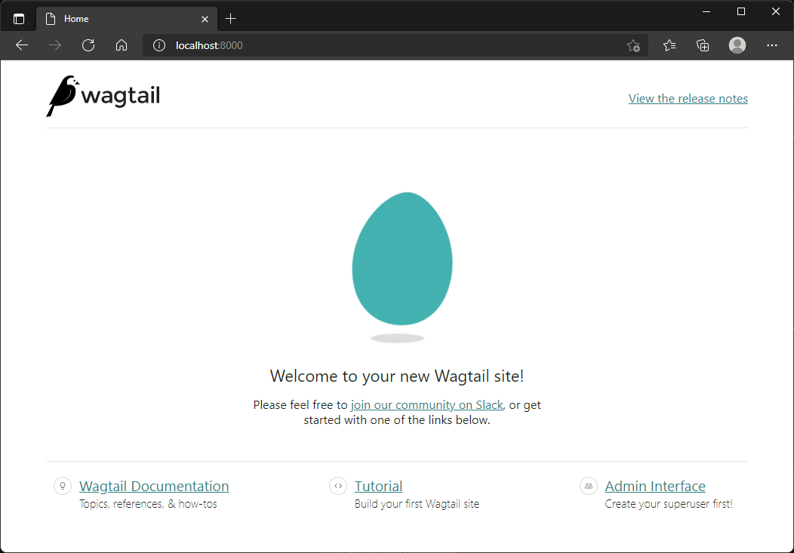
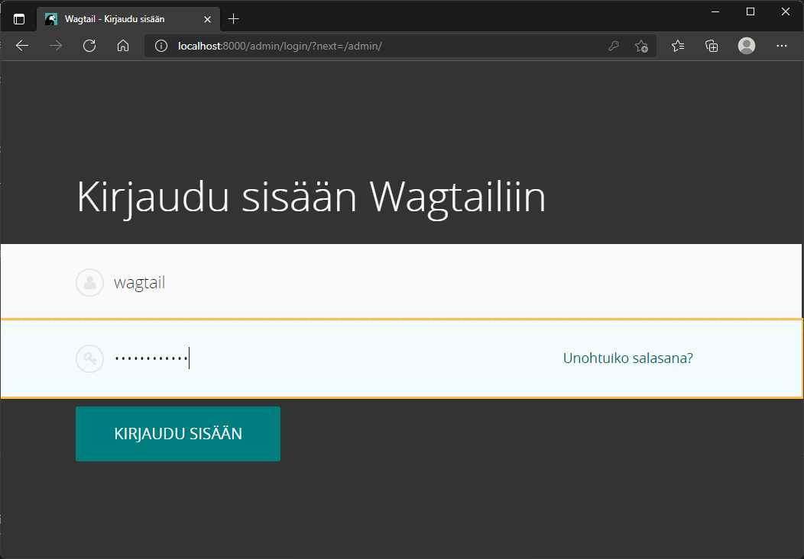

# Wagtail-blog - dockerized demo of the Wagtail blog app

## Installing

        git clone https://github.com/pasiol/wagtail-blog.git
        
Install Python virtual environment to the project folder and activate it.

        cd wagtail-blog
        python3 -m venv .venv
        mkdir sqlite
        source .venv/bin/activate
        pip install -r requirements.txt
        python manage.py migrate

Localize language and timezone on the file settings/base.py.

        # Internationalization
        # https://docs.djangoproject.com/en/3.2/topics/i18n/

        LANGUAGE_CODE = 'fi-fi'

        TIME_ZONE = 'Europe/Helsinki'

## Running locally dev environment

On the Python virtual environment:

        python manage.py runserver 0:8000

### Building docker container

        docker build -t wagtail_blog .

### Running local docker dev environment

         docker run --rm -p 8000:8000 -v $PWD/sqlite:/app/sqlite -e SITE_NAME="Blog-app demo" wagtail_blog

## Creating admin user for management purposes.

    python manage.py createsuperuser

Test created user on Python environment and docker dev container, the same user should work on both instances. The dev database is on subfolder sqlite.

[http://localhost:8000/admin]

